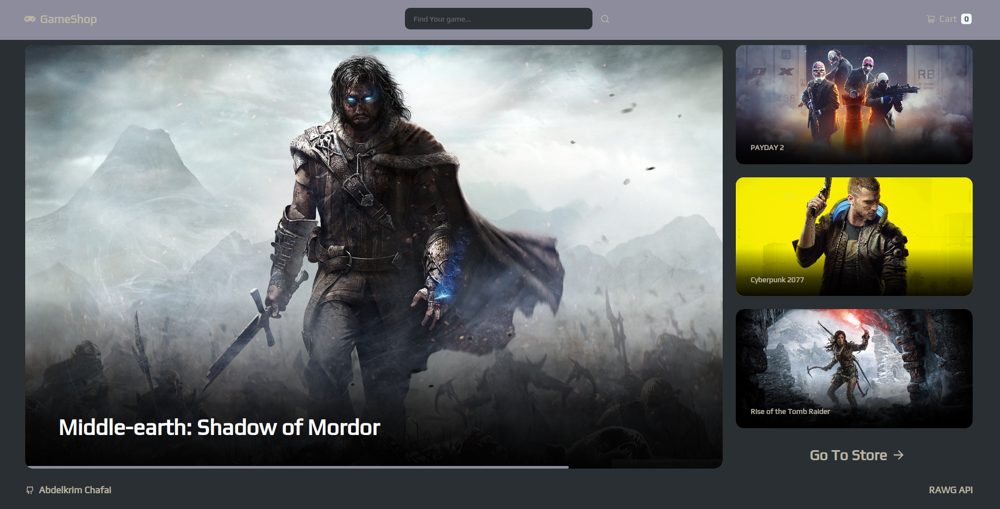

	<h1>Game Shopping Cart App
	 
		
		
		 
	</h1>
	<h3> 👇 Check It Out 👇 </h3>

## 📝 Description
My take on building a shopping cart for a game store. 
-I made this app with react. 
-Used the Framer Motion react librery for animation. 
-Also used the React Router Dom for routing. 
-And styled the pages with Css.

## 🛠️ Built with
 * CSS.
 * React.
 * React-Router-Dom.
 * Framer-Motion.
